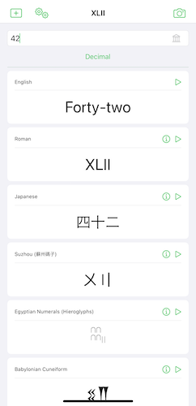
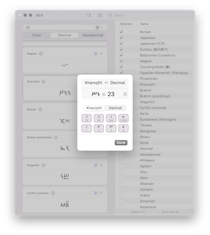
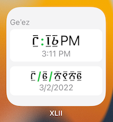

# XLII

A small iOS / macOS application that lets you explore numbers / numerals from around the world.
Originally started as a toy project to gain familiarity with SwiftUI, the project quickly grew from converting between arabic and roman numerals to including most numerals / numbers found on Wikipedia.

For most numerals, conversion from / to arabic numbers is reversible. XLII provides custom keyboards to input non-latin characters.
The exception are numeral systems relying on whitespace to indicate the absence of a value (e.g. Babylonian).

To achieve full immersion, use the XLII Clock widget to display the current date and time in a number format of your choosing directly in your Home Screen. 

The [XLIICore](XLIICore/README.md) package provides parsing / conversion / formatting and powers XLII. See the [documentation](XLIICore/README.md) for details.

Currently, XLII supports:

- Arabic numerals (naturally)
- Roman numerals
- Japanese numerals (including financial notation)
- Babylonian Cuneiform numerals (base 60)
- Aegean numerals (Linear B script)
- Chinese counting rods (籌)
- Egyptian Hieroglyphs
- Suzhou numbers (蘇州碼子)
- Phoenician numbers
- Kharoṣṭhī numerals
- Brahmi numerals
- Glagolitic numerals
- Cyrillic numerals
- Ge'ez numbers
- Sundanese numbers
- Tibetan numbers
- Mongolian numbers
- hexadecimal, binary, octal, vigesimal, etc.
- spell-out notation for many languages

## Licence
GPLv3 for the XLII application

MIT for XLIICore
